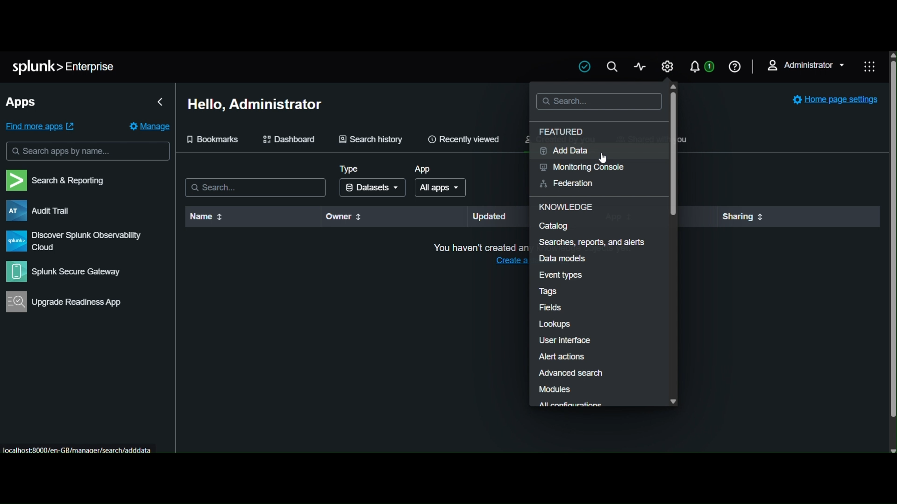
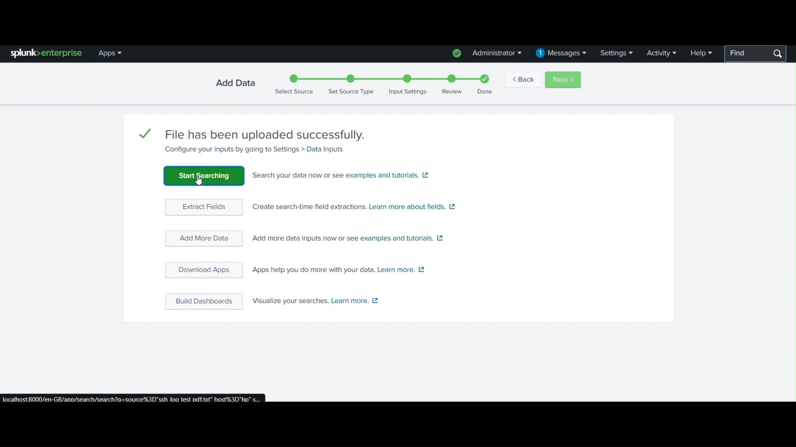
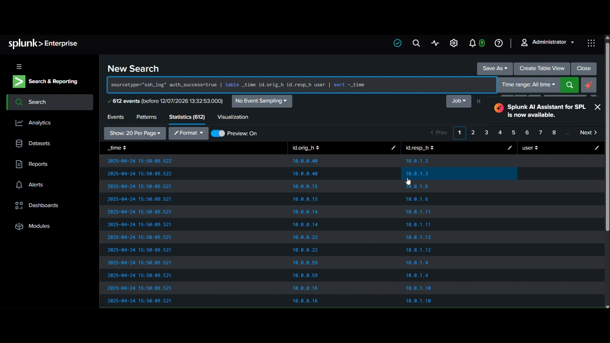
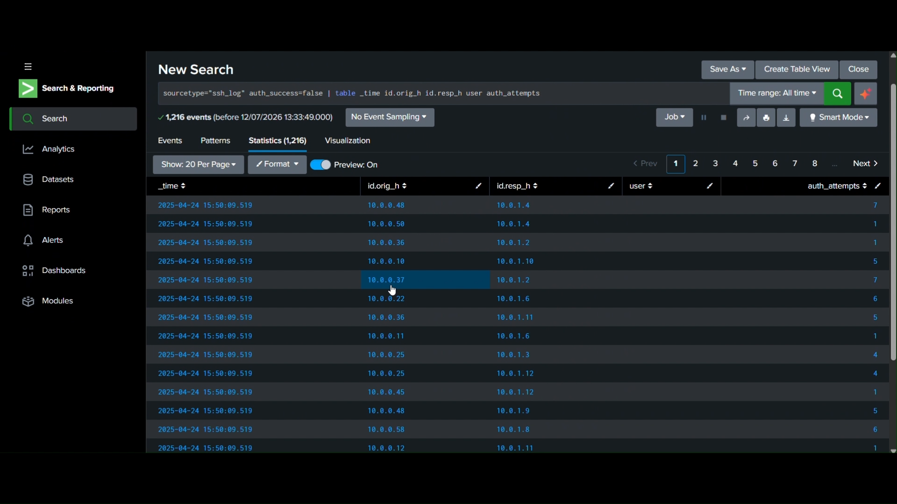
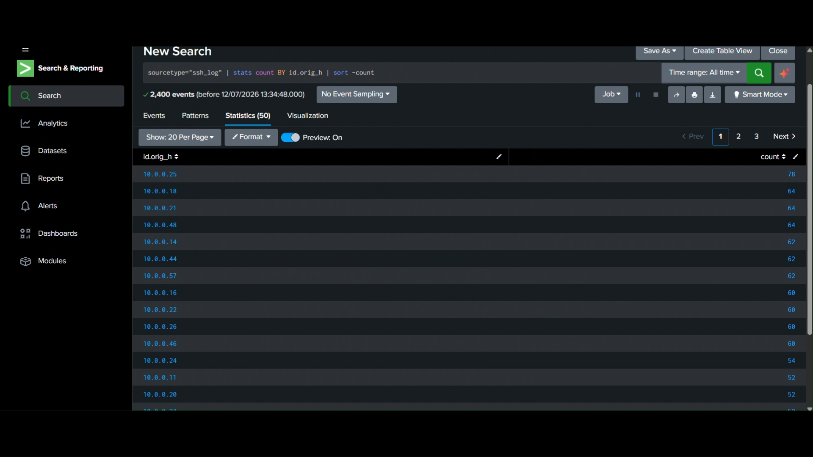
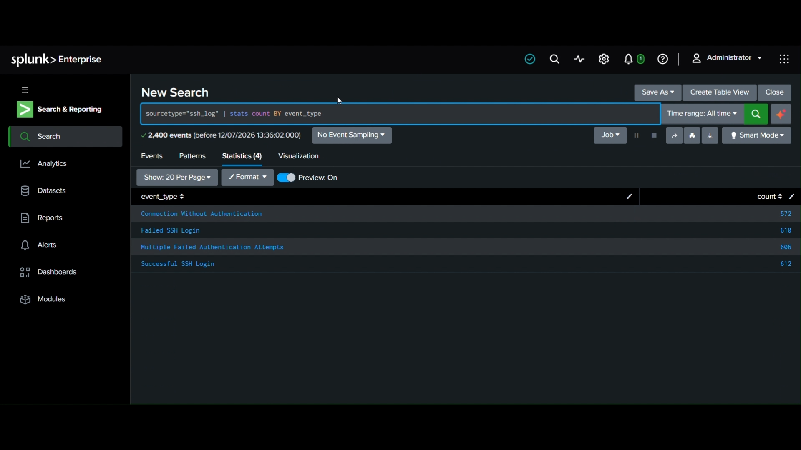
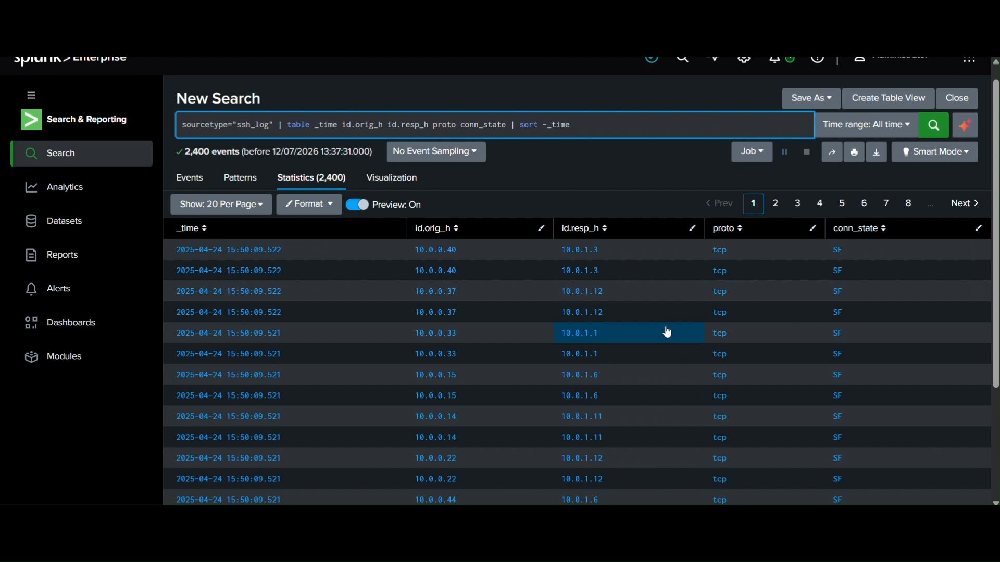

# Splunk SSH Log Analysis & Security Monitoring

## 📌 Project Overview

This project demonstrates the use of **Splunk Enterprise** for analyzing SSH authentication and network connection logs.

The project focuses on ingesting log data into Splunk, creating SPL queries, identifying authentication activity, analyzing source IP addresses, and reviewing different SSH event types.

## 🎯 Objectives

* Ingest SSH log data into Splunk Enterprise
* Search and analyze security events using **SPL**
* Identify successful and failed SSH authentication attempts
* Analyze source/origin IP addresses
* Analyze SSH event types
* Examine network connection information
* Understand how Splunk can support **SOC monitoring and security analysis**

## 🛠️ Tools & Technologies

* **Splunk Enterprise**
* **SPL (Search Processing Language)**
* SSH Logs
* Security Log Analysis
* Network Traffic Analysis

## 🔍 Project Workflow

### 1. Splunk Add Data

The **Add Data** section of Splunk Enterprise was opened to begin the log ingestion process.



### 2. Select Data Ingestion Method

Splunk provides multiple methods for importing data, including **Upload, Monitor, and Forward**. For this project, the **Upload** method was selected.


### 3. Upload SSH Log File

The SSH log file `ssh_log test pdf.txt` was selected and successfully uploaded to Splunk.


### 4. Upload Completed

Splunk confirmed that the log file was successfully uploaded and provided the option to start searching the imported data.



## 📊 Log Analysis

### 5. Successful SSH Authentication Analysis

An SPL query was used to identify successful authentication events and display relevant fields such as timestamp, source IP, destination IP, and user information.



### 6. Failed Authentication Analysis

The query filtered events where `auth_success=false` to identify failed authentication attempts. The results contained **1,216 events**.



### 7. Source IP Analysis

The `stats count BY id.orig_h` query was used to count activity by source/origin IP address. This helps identify IP addresses generating higher amounts of network activity.



### 8. SSH Event Type Analysis

The `stats count BY event_type` query was used to understand the distribution of different SSH-related events.

The analysis identified event types including:

* Connection Without Authentication
* Failed SSH Login
* Multiple Failed Authentication Attempts
* Successful SSH Login



### 9. Connection Analysis

Network connection information was analyzed using fields such as:

* Source IP (`id.orig_h`)
* Destination IP (`id.resp_h`)
* Protocol (`proto`)
* Connection State (`conn_state`)

This helps provide visibility into SSH/network communication patterns.



## 🛡️ Security Relevance

This project demonstrates how a **SOC analyst** can use Splunk to:

* Monitor authentication activity
* Detect failed login attempts
* Investigate suspicious source IP addresses
* Analyze SSH event patterns
* Investigate network connections
* Support security incident investigation

## 💡 Key Learning

Through this project, I gained practical experience with **Splunk Enterprise, SPL queries, log ingestion, authentication analysis, source IP analysis, and security event investigation**.

## 📁 Project Structure

```text
Splunk-SSH-Log-Analysis/
│
├── README.md
│
└── screenshots/
    ├── 01-splunk-enterprise-add-data.png
    ├── 02-splunk-add-data-methods.png
    ├── 03-splunk-file-upload-success.png
    ├── 04-splunk-upload-complete.png
    ├── 05-splunk-log-search-results.png
    ├── 06-splunk-failed-authentication-analysis.png
    ├── 07-splunk-source-ip-analysis.png
    ├── 08-splunk-event-type-analysis.png
    └── 09-splunk-connection-analysis.png
```

## 👨‍💻 Author

**Rohit Bavaskar**

Cyber Security | SOC Analysis | Network Security
